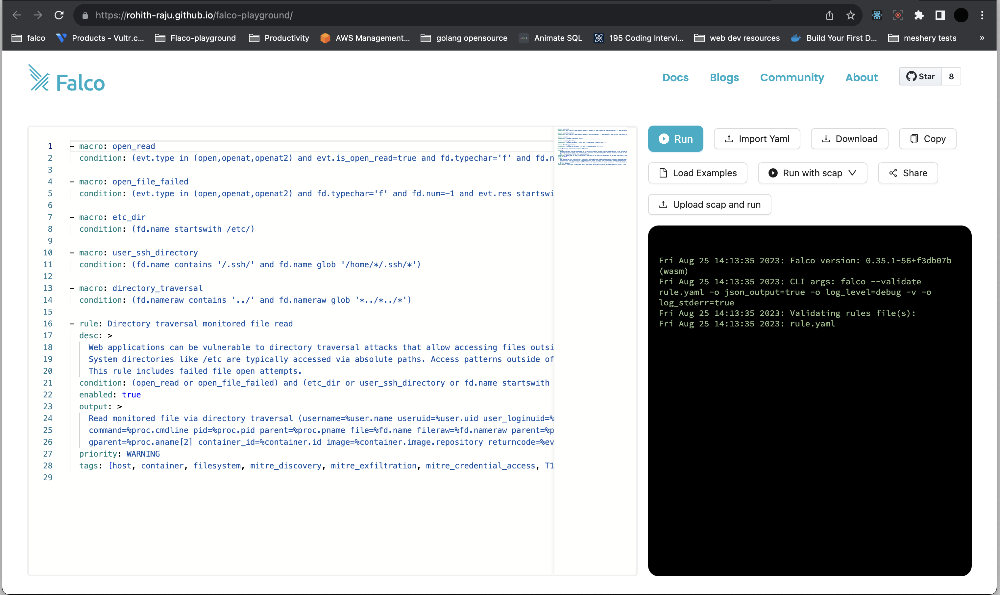
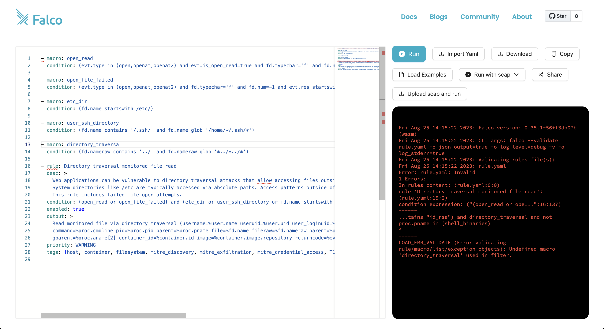

# Google Summer of Code 2023 - CNCF at Falco

## Project repo can be found here: https://github.com/falcosecurity/falco-playground

## Project Title: Falco Playground: Web IDE for Security Rules with WebAssembly

Falco provides an intuitive and highly expressive rule language for configuring its powerful runtime security engine. However, the community still lacks an official and frictionless IDE solution for writing and testing Falco rules.

Since the last few releases, the Falco libraries increased the support for multiple architectures and platforms, and the integrated rules validator added a new output in machine-readable JSON format.

The idea for this project is to add WebAssembly as a new officially-supported compilation target for Falco by leveraging the Emscripten toolchain, and creating a new development environment for security rules in the form of a web single-page application by running Falco right inside the browser. The end result is envisioned to be similar to the Go Playground, but without the need of any backend.

The beauty of this idea is the opportunity of experiencing very different technologies of the cloud-native landscape all in a single project: low-level system code close to the Linux kernel, the fast-growing WebAssembly world, and frontend development for a web application. The feasibility of the project has already been assessed.

### Expected Outcome

The rules editor playground will dramatically benefit the learning curve and the development experience of security practitioners writing Falco rules, and will be the basis on which new educational content could be created for the community.

The web application code will likely live in its own standalone repository under the Falcosecurity organization.

A stretch goal would be to provide reusable groundwork for future integrations with other IDEs supporting WebAssembly, such as Visual Studio Code.

## Commits and Pull requests for this Project

1. To compile falco libs to wasm: [Support build for wasm - Libs](https://github.com/falcosecurity/libs/pull/1156)
2. To compile falco to wasm: [Suport build for wasm - Falco](https://github.com/falcosecurity/falco/pull/2663)
3. You can find the commits for the playground here: [Falco playground](https://github.com/falcosecurity/falco-playground/commits/main?author=Rohith-Raju)

## Falco Playground in Action

## Addional Pull requests

1. [Support Memfd syscall](https://github.com/falcosecurity/libs/pull/1127)
2. [Support pidfd_getfd Syscall](https://github.com/falcosecurity/libs/pull/1145)
3. [Pidfd_open syscall](https://github.com/falcosecurity/libs/pull/1187)
4. [Parsers for memfd](https://github.com/falcosecurity/libs/pull/1162)

## Conclutions

I had the pleasure of working on a project for Google Summer of Code (GSoC) with my mentor, @jasondellaluce who relentlessly extended his helping hand whenever in need. It was a fantastic experience from start to finish, and I'm grateful to all the members who made this my best summer yet.
